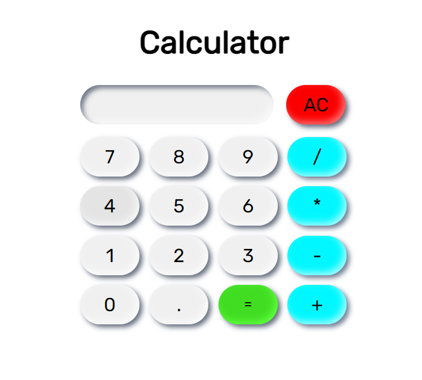

# Calculator

> Calculator

## Table of contents

- [General info](#general-info)
- [Screenshots](#screenshots)
- [Technologies](#technologies)
- [Setup](#setup)
- [Features](#features)
- [Status](#status)
- [Contact](#contact)

## General info

Working calculator with neumorphism styling.

## Screenshots

## Technologies

- HTML
- CSS
- JavaScript

## Setup

Open the index.html in any modern browser.

## Features

- Button click effect
- Neumorphism styling

## Status

Project is: _finished_

## Contact

Created by billsboroughscott@gmail.com - feel free to contact me.
